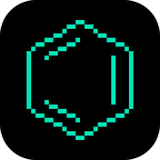

<picture>
  <source media="(prefers-color-scheme: dark)" srcset="./profile/avatar-dark.png">
  
</picture>

<picture>
  <source media="(prefers-color-scheme: dark)" srcset="./profile/banner-dark.svg">
  
</picture>

 個人首頁：

<table>
<tr>
<td>操作系統</td>
<td>

</td>
</tr>
<tr>
<td>發行版</td>
<td>

</td>
</tr>
<tr>
<td>雲原生</td>
<td>

</td>
</tr>
<tr>
<td>程式語言</td>
<td>

</td>
</tr>
<tr>
<td>前端工具鏈</td>
<td>

</td>
</tr>
<tr>
<td>客戶端嵌入式</td>
<td>

</td>
</tr>
<tr>
<td>数学排版</td>
<td>

</td>
</tr>
<tr>
<td>其他</td>
<td>

</td>
</tr>
</table>

<table align="center">
<tr>
<td>

<picture>
  <source media="(prefers-color-scheme: dark)" srcset="https://raw.githubusercontent.com/inorganben/inorganben/summary-cards/profile-summary-card-output/github_dark/3-stats.svg">
  
</picture>

</td>
<td>

<picture>
  <source media="(prefers-color-scheme: dark)" srcset="https://raw.githubusercontent.com/inorganben/inorganben/summary-cards/profile-summary-card-output/github_dark/2-most-commit-language.svg">
  
</picture>

</td>
</tr>
</table>

<picture>
  <source media="(prefers-color-scheme: dark)" srcset="https://raw.githubusercontent.com/inorganben/inorganben/gh-pages/github-contributions-snake-dark.svg">
  
</picture>
